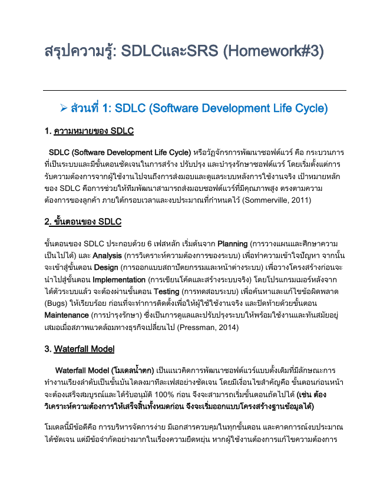

Markdown
# รายงานส่งงาน HW 8 — HTML + CSS + Cloud Deployment

## === Student Info ===
- **Name:** MR Hongsakoun Sisavathdy (Dan)
- **Student ID:** 6810301028

## === Website Info ===
- **URL (Local / IIS):** http://localhost:8080
- **URL (Cloud):** https://houngsakoun.github.io/
- **Number of Pages:** 8 หน้า (Home, About, CV, Portfolio, Contact, Skills, Gallery, Hobby)
- **Menu Structure:** Home | About | CV | Portfolio | Contact | Skills | Gallery | Hobby (แสดงบน Navigation Bar ด้านบนของทุกหน้า)

---

## === Pages Detail ===

### --- Page: Home / หน้าแรก ---
- **File Name:** `index.html`
- **Description:** หน้าแรกต้อนรับผู้เข้าชม แนะนำตัวอย่างเป็นทางการ มีการเชื่อมโยงไปยังหน้าผลงาน หน้าข้อมูลส่วนตัว ประวัติ และติดต่อ

**Code:**
```html
<!DOCTYPE html>
<html lang="th">
<head>
  <meta charset="UTF-8">
  <meta name="viewport" content="width=device-width, initial-scale=1.0">
  <title>หน้าแรก | เว็บไซต์ส่วนตัว</title>
  <link rel="stylesheet" href="css/style.css">
</head>
<body>

<header>
  <h1 class="site-title">เว็บไซต์ส่วนตัวของ Dan</h1>
  <nav>
    <ul class="menu">
      <li><a href="index.html">Home</a></li>
      <li><a href="about.html">About</a></li>
      <li><a href="cv.html">CV</a></li>
      <li><a href="portfolio.html">Portfolio</a></li>
      <li><a href="contact.html">Contact</a></li>
      <li><a href="skills.html">Skills</a></li>
      <li><a href="gallery.html">Gallery</a></li>
      <li><a href="hobby.html">Hobby</a></li>
    </ul>
  </nav>
</header>
<main>

<section class="hero">
  
  <div class="hero-text">
    <h2>สวัสดีครับ ผมชื่อ Hongsakoun Sisavathdy</h2>
    <p>นักศึกษาสาขา Computer Engineering คณะเทคโนโลยีดิจิทัล มหาวิทยาลัย CDTI</p>
    <p>ยินดีต้อนรับสู่เว็บไซต์ส่วนตัวของผม เว็บไซต์นี้รวบรวมข้อมูลส่วนตัว ประวัติการศึกษา
       ผลงานการบ้าน และช่องทางการติดต่อ สามารถเลือกดูได้จากเมนูด้านบน</p>
    <a href="portfolio.html" class="btn">ดูผลงานของผม</a>
  </div>
</section>
<section class="cards">
  <article class="card">
    <h3>เกี่ยวกับผม</h3>
    <p>ทำความรู้จักตัวตน ความสนใจ และเป้าหมายของผม</p>
    <a href="about.html" class="btn btn-outline">อ่านต่อ</a>
  </article>
  <article class="card">
    <h3>ประวัติย่อ (CV)</h3>
    <p>การศึกษา ทักษะ และประสบการณ์ที่ผ่านมา</p>
    <a href="cv.html" class="btn btn-outline">อ่านต่อ</a>
  </article>
  <article class="card">
    <h3>ติดต่อผม</h3>
    <p>ส่งข้อความถึงผมได้ผ่านแบบฟอร์มติดต่อ</p>
    <a href="contact.html" class="btn btn-outline">ติดต่อ</a>
  </article>
</section>

</main>
<footer>
  <p>© 2026 Hongsakoun Sisavathdy | รหัสนักศึกษา 6810301028 | จัดทำเพื่อการบ้าน HW 8</p>
</footer>
</body>
</html>
--- Page: About / เกี่ยวกับฉัน ---
File Name: about.html

Description: หน้าแนะนำตัวเพิ่มเติมเพื่อแสดงถึงเป้าหมายการศึกษาและความมุ่งมั่นในสายงาน

Code:

HTML
<!DOCTYPE html>
<html lang="th">
<head>
  <meta charset="UTF-8">
  <meta name="viewport" content="width=device-width, initial-scale=1.0">
  <title>เกี่ยวกับฉัน | เว็บไซต์ส่วนตัว</title>
  <link rel="stylesheet" href="css/style.css">
</head>
<body>

<header>
  <h1 class="site-title">เว็บไซต์ส่วนตัวของ Dan</h1>
  <nav>
    <ul class="menu">
      <li><a href="index.html">Home</a></li>
      <li><a href="about.html">About</a></li>
      <li><a href="cv.html">CV</a></li>
      <li><a href="portfolio.html">Portfolio</a></li>
      <li><a href="contact.html">Contact</a></li>
      <li><a href="skills.html">Skills</a></li>
      <li><a href="gallery.html">Gallery</a></li>
      <li><a href="hobby.html">Hobby</a></li>
    </ul>
  </nav>
</header>
<main>

<h2>เกี่ยวกับฉัน</h2>
<section class="two-col">
  
  <div>
    <p>ผมชื่อ MR Hongsakoun ชื่อเล่น Dan ปัจจุบันกำลังศึกษาอยู่ชั้นปีที่ 2
       สาขา Computer Engineering มหาวิทยาลัย CDTI</p>
    <p>ผมมีความสนใจด้านการพัฒนาเว็บไซต์และเทคโนโลยีคอมพิวเตอร์
       ชอบเรียนรู้สิ่งใหม่ ๆ และฝึกฝนทักษะการเขียนโปรแกรมอยู่เสมอ</p>
    <h3>เป้าหมายของผม</h3>
    <ul>
      <li>พัฒนาทักษะการเขียนเว็บไซต์ให้เชี่ยวชาญ</li>
      <li>ฝึกงานในบริษัทด้านเทคโนโลยี</li>
      <li>สร้างผลงานของตัวเองเผยแพร่สู่สาธารณะ</li>
    </ul>
  </div>
</section>

</main>
<footer>
  <p>© 2026 Hongsakoun Sisavathdy | รหัสนักศึกษา 6810301028 | จัดทำเพื่อการบ้าน HW 8</p>
</footer>
</body>
</html>
--- Page: CV / Resume ---
File Name: cv.html

Description: ข้อมูลประวัติย่อแบบละเอียด แบ่งออกเป็นหมวดหมู่ ข้อมูลการศึกษา ทักษะ ประสบการณ์ และประวัติส่วนตัว

Code:

HTML
<!DOCTYPE html>
<html lang="th">
<head>
  <meta charset="UTF-8">
  <meta name="viewport" content="width=device-width, initial-scale=1.0">
  <title>CV / Resume | เว็บไซต์ส่วนตัว</title>
  <link rel="stylesheet" href="css/style.css">
</head>
<body>

<header>
  <h1 class="site-title">เว็บไซต์ส่วนตัวของ Dan</h1>
  <nav>
    <ul class="menu">
      <li><a href="index.html">Home</a></li>
      <li><a href="about.html">About</a></li>
      <li><a href="cv.html">CV</a></li>
      <li><a href="portfolio.html">Portfolio</a></li>
      <li><a href="contact.html">Contact</a></li>
      <li><a href="skills.html">Skills</a></li>
      <li><a href="gallery.html">Gallery</a></li>
      <li><a href="hobby.html">Hobby</a></li>
    </ul>
  </nav>
</header>
<main>

<h2>ประวัติย่อ (CV / Resume)</h2>
<section class="cv-block">
  <h3>ข้อมูลส่วนตัว</h3>
  <p><strong>ชื่อ:</strong> Hongsakoun Sisavathdy<br>
     <strong>รหัสนักศึกษา:</strong> 6810301028<br>
     <strong>วันเกิด:</strong> 30/05/2549</p>
</section>
<section class="cv-block">
  <h3>การศึกษา</h3>
  <ul>
    <li>2567 - ปัจจุบัน : ปริญญาตรี สาขา Computer Engineering มหาวิทยาลัย CDTI</li>
    <li>2561 - 2566 : มัธยมศึกษา โรงเรียน Culture 67 km</li>
  </ul>
</section>
<section class="cv-block">
  <h3>ทักษะ (Skills)</h3>
  <ul>
    <li>HTML5, CSS, Python, Network เบื้องต้น</li>
    <li>Microsoft Office (Word, Excel, PowerPoint)</li>
    <li>การติดตั้งและตั้งค่า IIS Web Server</li>
  </ul>
</section>
<section class="cv-block">
  <h3>ประสบการณ์</h3>
  <ul>
    <li>พัฒนาเว็บไซต์ส่วนตัวและ Deploy ขึ้น Cloud</li>
    <li>ทำโครงงานรายวิชา Back-End Software Development</li>
  </ul>
</section>
<section class="cv-block">
  <h3>ช่องทางติดต่อ</h3>
  <ul>
    <li>อีเมล: largamesx@gmail.com</li>
    <li>โทรศัพท์: 0829744167</li>
    <li>GitHub: [https://github.com/Houngsakoun](https://github.com/Houngsakoun)</li>
  </ul>
</section>

</main>
<footer>
  <p>© 2026 Hongsakoun Sisavathdy | รหัสนักศึกษา 6810301028 | จัดทำเพื่อการบ้าน HW 8</p>
</footer>
</body>
</html>
--- Page: Portfolio / ผลงานการบ้าน ---
File Name: portfolio.html

Description: หน้ารวบรวมผลงานการบ้านที่ผ่านมาในรายวิชา พร้อมฟังก์ชันให้กดดูโค้ดผ่านลิงก์ของอาจารย์ และดาวน์โหลดไฟล์ Zip ได้โดยตรง

Code:

HTML
<!DOCTYPE html>
<html lang="th">
<head>
  <meta charset="UTF-8">
  <meta name="viewport" content="width=device-width, initial-scale=1.0">
  <title>ผลงานการบ้าน | เว็บไซต์ส่วนตัว</title>
  <link rel="stylesheet" href="css/style.css">
</head>
<body>

<header>
  <h1 class="site-title">เว็บไซต์ส่วนตัวของ Dan</h1>
  <nav>
    <ul class="menu">
      <li><a href="index.html">Home</a></li>
      <li><a href="about.html">About</a></li>
      <li><a href="cv.html">CV</a></li>
      <li><a href="portfolio.html">Portfolio</a></li>
      <li><a href="contact.html">Contact</a></li>
      <li><a href="skills.html">Skills</a></li>
      <li><a href="gallery.html">Gallery</a></li>
      <li><a href="hobby.html">Hobby</a></li>
    </ul>
  </nav>
</header>

<main>
  <h2>ผลงานการบ้าน (Portfolio / Homework)</h2>
  <p>รวมผลงานการบ้านทั้งหมดในรายวิชา สามารถกดดูหรือดาวน์โหลดได้</p>
  
  <section class="cards">
    <article class="card">
      <h3>HW 2:</h3>
      <p>C# Windows Forms Application (Address Book)</p>
      <div class="btn-group">
        <a href="[https://cdti365-my.sharepoint.com/shared?id=%2Fpersonal%2Fsarayut%5Fcha%5Fms%5Fcdti%5Fac%5Fth%2FDocuments%2FCDTI%2FTeach%2F2026%2F1st%2DBackend%2FStudentArea%2FStudentData%2F6810301028%5Fhongsakoun%2FHome%20work%2FHW02%5F6810301028&listurl=%2Fpersonal%2Fsarayut%5Fcha%5Fms%5Fcdti%5Fac%5Fth%2FDocuments&viewid=95b988d0%2D29ca%2D430c%2D96bd%2D483e05092c2c&ga=1](https://cdti365-my.sharepoint.com/shared?id=%2Fpersonal%2Fsarayut%5Fcha%5Fms%5Fcdti%5Fac%5Fth%2FDocuments%2FCDTI%2FTeach%2F2026%2F1st%2DBackend%2FStudentArea%2FStudentData%2F6810301028%5Fhongsakoun%2FHome%20work%2FHW02%5F6810301028&listurl=%2Fpersonal%2Fsarayut%5Fcha%5Fms%5Fcdti%5Fac%5Fth%2FDocuments&viewid=95b988d0%2D29ca%2D430c%2D96bd%2D483e05092c2c&ga=1)" class="btn" target="_blank">View</a>
        <a href="DL/hw2.zip" class="btn btn-outline" download>Download</a>
      </div>
    </article>

    <article class="card">
      <h3>HW 3:</h3>
      <p>การทบทวนความรู้ SDLC และ SRS</p>
      <div class="btn-group">
        <a href="[https://cdti365-my.sharepoint.com/shared?id=%2Fpersonal%2Fsarayut%5Fcha%5Fms%5Fcdti%5Fac%5Fth%2FDocuments%2FCDTI%2FTeach%2F2026%2F1st%2DBackend%2FStudentArea%2FStudentData%2F6810301028%5Fhongsakoun%2FHome%20work%2FHW03%5F6810301028&listurl=%2Fpersonal%2Fsarayut%5Fcha%5Fms%5Fcdti%5Fac%5Fth%2FDocuments&viewid=95b988d0%2D29ca%2D430c%2D96bd%2D483e05092c2c&ga=1](https://cdti365-my.sharepoint.com/shared?id=%2Fpersonal%2Fsarayut%5Fcha%5Fms%5Fcdti%5Fac%5Fth%2FDocuments%2FCDTI%2FTeach%2F2026%2F1st%2DBackend%2FStudentArea%2FStudentData%2F6810301028%5Fhongsakoun%2FHome%20work%2FHW03%5F6810301028&listurl=%2Fpersonal%2Fsarayut%5Fcha%5Fms%5Fcdti%5Fac%5Fth%2FDocuments&viewid=95b988d0%2D29ca%2D430c%2D96bd%2D483e05092c2c&ga=1)" class="btn" target="_blank">View</a>
        <a href="Homework_3.pdf" class="btn btn-outline" download>Download</a>
      </div>
    </article>

    <article class="card">
      <h3>HW 7:</h3>
      <p>พัฒนาเว็บไซต์ Personal Homepage ด้วย HTML5 + CSS และ Deploy บน IIS และ Cloud</p>
      <div class="btn-group">
        <a href="index.html" class="btn">View</a>
        <a href="DL/wwwroot.zip" class="btn btn-outline" download>Download</a>
      </div>
    </article>
  </section>
</main>

<footer>
  <p>© 2026 Hongsakoun Sisavathdy | รหัสนักศึกษา 6810301028 | จัดทำเพื่อการบ้าน HW 8</p>
</footer>

</body>
</html>
--- Page: Contact / ติดต่อฉัน ---
File Name: contact.html

Description: หน้าที่ใช้รับส่งข้อความ มีฟอร์มติดต่อกลับด้วยเทคโนโลยี HTML พร้อมแนบที่อยู่ติดต่อสื่อสารภายนอกอื่นๆ

Code:

HTML
<!DOCTYPE html>
<html lang="th">
<head>
  <meta charset="UTF-8">
  <meta name="viewport" content="width=device-width, initial-scale=1.0">
  <title>ติดต่อ | เว็บไซต์ส่วนตัว</title>
  <link rel="stylesheet" href="css/style.css">
</head>
<body>

<header>
  <h1 class="site-title">เว็บไซต์ส่วนตัวของ Dan</h1>
  <nav>
    <ul class="menu">
      <li><a href="index.html">Home</a></li>
      <li><a href="about.html">About</a></li>
      <li><a href="cv.html">CV</a></li>
      <li><a href="portfolio.html">Portfolio</a></li>
      <li><a href="contact.html">Contact</a></li>
      <li><a href="skills.html">Skills</a></li>
      <li><a href="gallery.html">Gallery</a></li>
      <li><a href="hobby.html">Hobby</a></li>
    </ul>
  </nav>
</header>
<main>

<h2>ติดต่อฉัน (Contact)</h2>
<p>หากต้องการติดต่อ สามารถกรอกแบบฟอร์มด้านล่างนี้ได้เลย</p>
<form class="contact-form">
  <div class="form-row">
    <label for="name">ชื่อ-นามสกุล</label>
    <input type="text" id="name" name="name" required>
  </div>
  <div class="form-row">
    <label for="email">อีเมล</label>
    <input type="email" id="email" name="email" required>
  </div>
  <div class="form-row">
    <label for="message">ข้อความ</label>
    <textarea id="message" name="message" rows="6" required></textarea>
  </div>
  <button type="submit" class="btn">ส่งข้อความ</button>
</form>
<section class="cv-block">
  <h3>ช่องทางอื่น ๆ</h3>
  <ul>
    <li>อีเมล: largamesx@gmail.com</li>
    <li>Facebook: Hongsakoun Sisavathdy</li>
  </ul>
</section>

</main>
<footer>
  <p>© 2026 Hongsakoun Sisavathdy | รหัสนักศึกษา 6810301028 | จัดทำเพื่อการบ้าน HW 8</p>
</footer>
</body>
</html>
--- Page: Skills / ทักษะ ---
File Name: skills.html

Description: หน้าที่ใช้แสดงทักษะความรู้ความสามารถในด้านเทคโนโลยี พัฒนาเว็บ ตลอดจนซอฟต์แวร์เครื่องมือต่างๆ

Code:

HTML
<!DOCTYPE html>
<html lang="th">
<head>
  <meta charset="UTF-8">
  <meta name="viewport" content="width=device-width, initial-scale=1.0">
  <title>ทักษะ | เว็บไซต์ส่วนตัว</title>
  <link rel="stylesheet" href="css/style.css">
</head>
<body>

<header>
  <h1 class="site-title">เว็บไซต์ส่วนตัวของ Dan</h1>
  <nav>
    <ul class="menu">
      <li><a href="index.html">Home</a></li>
      <li><a href="about.html">About</a></li>
      <li><a href="cv.html">CV</a></li>
      <li><a href="portfolio.html">Portfolio</a></li>
      <li><a href="contact.html">Contact</a></li>
      <li><a href="skills.html">Skills</a></li>
      <li><a href="gallery.html">Gallery</a></li>
      <li><a href="hobby.html">Hobby</a></li>
    </ul>
  </nav>
</header>
<main>

<h2>ทักษะของฉัน (Skills)</h2>
<section class="cards">
  <article class="card">
    <h3>การพัฒนาเว็บ</h3>
    <p>HTML5, Python, Network เบื้องต้น</p>
  </article>
  <article class="card">
    <h3>เครื่องมือ</h3>
    <p>VS Code, Git และ GitHub, IIS Web Server</p>
  </article>
  <article class="card">
    <h3>ทักษะอื่น ๆ</h3>
    <p>การทำงานเป็นทีม การนำเสนองาน ภาษาอังกฤษเบื้องต้น</p>
  </article>
</section>

</main>
<footer>
  <p>© 2026 Hongsakoun Sisavathdy | รหัสนักศึกษา 6810301028 | จัดทำเพื่อการบ้าน HW 8</p>
</footer>
</body>
</html>
--- Page: Gallery / แกลเลอรี ---
File Name: gallery.html

Description: หน้าที่รวบรวมรูปภาพผลงาน รูปนักศึกษา และรูปประกอบต่างๆ จัดทำขึ้นเพื่อนำเสนอในรูปแบบ grid responsive image layout

Code:

HTML
<!DOCTYPE html>
<html lang="th">
<head>
  <meta charset="UTF-8">
  <meta name="viewport" content="width=device-width, initial-scale=1.0">
  <title>แกลเลอรี | เว็บไซต์ส่วนตัว</title>
  <link rel="stylesheet" href="css/style.css">
</head>
<body>

<header>
  <h1 class="site-title">เว็บไซต์ส่วนตัวของ Dan</h1>
  <nav>
    <ul class="menu">
      <li><a href="index.html">Home</a></li>
      <li><a href="about.html">About</a></li>
      <li><a href="cv.html">CV</a></li>
      <li><a href="portfolio.html">Portfolio</a></li>
      <li><a href="contact.html">Contact</a></li>
      <li><a href="skills.html">Skills</a></li>
      <li><a href="gallery.html">Gallery</a></li>
      <li><a href="hobby.html">Hobby</a></li>
    </ul>
  </nav>
</header>
<main>

<h2>แกลเลอรีรูปภาพ (Gallery)</h2>
<p>รวมรูปภาพของฉันและผลงานต่าง ๆ</p>
<section class="gallery">
  <figure>
    
    <figcaption>รูปนักศึกษา</figcaption>
  </figure>
  
  <figure>
    
    <figcaption>รูปประกอบ</figcaption>
  </figure>

  <figure>
    
    <figcaption>รูปผลงานการบ้าน2</figcaption>
  </figure> 

  <figure>
    
    <figcaption>รูปผลงานการบ้าน3</figcaption>
  </figure>

  <figure>
    
    <figcaption>รูปผลงานการบ้าน7</figcaption>
  </figure>
</section>   

</main>
<footer>
  <p>© 2026 Hongsakoun Sisavathdy | รหัสนักศึกษา 6810301028 | จัดทำเพื่อการบ้าน HW 8</p>
</footer>
</body>
</html>
--- Page: Hobby / งานอดิเรก ---
File Name: hobby.html

Description: หน้าอธิบายข้อมูลส่วนตัวเกี่ยวกับงานอดิเรก กิจกรรมยามว่าง กีฬาบาสเกตบอล และช่องทางการพัฒนาตนเอง

Code:

HTML
<!DOCTYPE html>
<html lang="th">
<head>
  <meta charset="UTF-8">
  <meta name="viewport" content="width=device-width, initial-scale=1.0">
  <title>งานอดิเรก | เว็บไซต์ส่วนตัว</title>
  <link rel="stylesheet" href="css/style.css">
</head>
<body>

<header>
  <h1 class="site-title">เว็บไซต์ส่วนตัวของ Dan</h1>
  <nav>
    <ul class="menu">
      <li><a href="index.html">Home</a></li>
      <li><a href="about.html">About</a></li>
      <li><a href="cv.html">CV</a></li>
      <li><a href="portfolio.html">Portfolio</a></li>
      <li><a href="contact.html">Contact</a></li>
      <li><a href="skills.html">Skills</a></li>
      <li><a href="gallery.html">Gallery</a></li>
      <li><a href="hobby.html">Hobby</a></li>
    </ul>
  </nav>
</header>
<main>

<h2>งานอดิเรกของฉัน (Play Basketball)</h2>
<section class="two-col">
  
  <div>
    <p>ยามว่างผมชอบทำกิจกรรมหลายอย่าง เพื่อผ่อนคลายและพัฒนาตัวเอง</p>
    <ul>
      <li>เล่นเกมและศึกษาการออกแบบเกม</li>
      <li>ฟังเพลง</li>
      <li>อ่านบทความเทคโนโลยี</li>
      <li>ออกกำลังกาย เล่นกีฬาบาสเกตบอล (Basketball)</li>
    </ul>
  </div>
</section>

</main>
<footer>
  <p>© 2026 Hongsakoun Sisavathdy | รหัสนักศึกษา 6810301028 | จัดทำเพื่อการบ้าน HW 8</p>
</footer>
</body>
</html>
=== CSS Code ===
File Name: css/style.css

Code:

CSS
/* นำเข้าฟอนต์ Google Fonts เพื่อความสวยงาม */
@import url('[https://fonts.googleapis.com/css2?family=Sarabun:wght@300;400;600;700&display=swap](https://fonts.googleapis.com/css2?family=Sarabun:wght@300;400;600;700&display=swap)');

* {
    box-sizing: border-box;
    margin: 0;
    padding: 0;
}

body {
    font-family: 'Sarabun', sans-serif;
    line-height: 1.6;
    background-color: #f5f7fa;
    color: #333;
    display: flex;
    flex-direction: column;
    min-height: 100vh;
}

/* --- ส่วนหัวเว็บไซต์ (Header) --- */
header {
    background: linear-gradient(135deg, #1e3c72 0%, #2a5298 100%);
    color: #fff;
    padding: 25px 0;
    text-align: center;
    box-shadow: 0 4px 10px rgba(0, 0, 0, 0.1);
}

.site-title {
    font-size: 2.2rem;
    margin-bottom: 10px;
    letter-spacing: 1px;
}

/* --- เมนูบาร์หลัก (Navigation Bar) --- */
.menu {
    list-style: none;
    display: flex;
    justify-content: center;
    flex-wrap: wrap;
    gap: 15px;
    margin-top: 15px;
}

.menu li a {
    color: #f1f1f1;
    text-decoration: none;
    padding: 8px 16px;
    font-weight: 600;
    font-size: 1rem;
    border-radius: 20px;
    transition: all 0.3s ease;
}

.menu li a:hover {
    background-color: rgba(255, 255, 255, 0.2);
    color: #fff;
    transform: translateY(-2px);
}

/* --- พื้นที่เนื้อหาหลัก (Main) --- */
main {
    flex: 1;
    padding: 40px 20px;
    max-width: 1200px;
    margin: 0 auto;
    width: 100%;
}

h2 {
    color: #1e3c72;
    margin-bottom: 20px;
    border-bottom: 2px solid #2a5298;
    padding-bottom: 8px;
    font-size: 1.8rem;
}

h3 {
    color: #2a5298;
    margin-bottom: 15px;
}

/* --- หน้าแรก Layout: Hero Section --- */
.hero {
    display: flex;
    align-items: center;
    gap: 40px;
    background: #fff;
    padding: 40px;
    border-radius: 12px;
    box-shadow: 0 4px 6px rgba(0, 0, 0, 0.05);
    margin-bottom: 40px;
}

.profile-img {
    width: 200px;
    height: 200px;
    object-fit: cover;
    border-radius: 50%;
    border: 5px solid #2a5298;
    box-shadow: 0 4px 10px rgba(0,0,0,0.1);
}

.hero-text {
    flex: 1;
}

.hero-text p {
    margin-bottom: 15px;
    font-size: 1.1rem;
}

/* --- Layout แบบแถวละสองคอลัมน์ (Two Columns) --- */
.two-col {
    display: flex;
    gap: 40px;
    background: #fff;
    padding: 30px;
    border-radius: 12px;
    box-shadow: 0 4px 6px rgba(0,0,0,0.05);
    align-items: center;
}

.two-col img {
    max-width: 350px;
    height: auto;
    border-radius: 8px;
    box-shadow: 0 4px 8px rgba(0,0,0,0.1);
}

.two-col div {
    flex: 1;
}

.two-col ul {
    list-style-position: inside;
    margin-top: 15px;
}

.two-col li {
    margin-bottom: 8px;
    font-size: 1.05rem;
}

/* --- การแสดงผลแบบการ์ด (Cards Grid) --- */
.cards {
    display: grid;
    grid-template-columns: repeat(auto-fit, minmax(280px, 1fr));
    gap: 25px;
    margin-top: 20px;
}

.card {
    background: #fff;
    padding: 30px;
    border-radius: 12px;
    box-shadow: 0 4px 6px rgba(0, 0, 0, 0.05);
    transition: all 0.3s ease;
    border: 1px solid #eef2f5;
    display: flex;
    flex-direction: column;
    justify-content: space-between;
}

.card:hover {
    transform: translateY(-5px);
    box-shadow: 0 8px 15px rgba(0, 0, 0, 0.1);
}

.card p {
    margin-bottom: 20px;
    color: #666;
}

/* --- จัดกลุ่มปุ่ม (Button Group) --- */
.btn-group {
    display: flex;
    gap: 10px;
}

/* --- ปุ่มสไตล์ต่าง ๆ (Buttons) --- */
.btn {
    display: inline-block;
    padding: 10px 20px;
    background-color: #2a5298;
    color: #fff;
    text-decoration: none;
    border-radius: 5px;
    font-weight: 600;
    transition: background-color 0.3s ease;
    border: 2px solid #2a5298;
    cursor: pointer;
    text-align: center;
}

.btn:hover {
    background-color: #1e3c72;
    border-color: #1e3c72;
}

.btn-outline {
    background-color: transparent;
    color: #2a5298;
}

.btn-outline:hover {
    background-color: #2a5298;
    color: #fff;
}

/* --- ส่วนประวัติย่อ (CV Section) --- */
.cv-block {
    background: #fff;
    padding: 30px;
    border-radius: 12px;
    box-shadow: 0 4px 6px rgba(0, 0, 0, 0.05);
    margin-bottom: 25px;
}

.cv-block ul {
    list-style-position: inside;
}

.cv-block li {
    margin-bottom: 8px;
}

/* --- ฟอร์มติดต่อกลับ (Contact Form) --- */
.contact-form {
    background: #fff;
    padding: 35px;
    border-radius: 12px;
    box-shadow: 0 4px 6px rgba(0,0,0,0.05);
    margin-bottom: 30px;
}

.form-row {
    margin-bottom: 20px;
    display: flex;
    flex-direction: column;
}

.form-row label {
    font-weight: 600;
    margin-bottom: 8px;
    color: #1e3c72;
}

.form-row input, .form-row textarea {
    padding: 12px;
    border: 1px solid #ccc;
    border-radius: 6px;
    font-size: 1rem;
    font-family: inherit;
}

.form-row input:focus, .form-row textarea:focus {
    outline: none;
    border-color: #2a5298;
    box-shadow: 0 0 5px rgba(42, 82, 152, 0.3);
}

/* --- แกลเลอรี (Gallery System) --- */
.gallery {
    display: grid;
    grid-template-columns: repeat(auto-fit, minmax(220px, 1fr));
    gap: 20px;
    margin-top: 25px;
}

.gallery figure {
    background: #fff;
    padding: 15px;
    border-radius: 10px;
    box-shadow: 0 4px 6px rgba(0,0,0,0.05);
    text-align: center;
}

.gallery img {
    width: 100%;
    height: 180px;
    object-fit: cover;
    border-radius: 6px;
    margin-bottom: 10px;
}

.gallery figcaption {
    font-size: 0.95rem;
    color: #555;
}

/* --- ส่วนท้ายเว็บไซต์ (Footer) --- */
footer {
    background-color: #1e3c72;
    color: #fff;
    text-align: center;
    padding: 20px 0;
    margin-top: auto;
    font-size: 0.95rem;
}

/* --- หน้าจอมือถือ (Responsive design) --- */
@media (max-width: 768px) {
    .hero {
        flex-direction: column;
        text-align: center;
    }
    .two-col {
        flex-direction: column;
        text-align: center;
    }
    .two-col img {
        max-width: 100%;
    }
}
=== Features Checklist ===
Homepage: มี (index.html — หน้าแรกสำหรับเชื่อมโยงและแนะนำตัวด้วย Hero layout)

Menu: มี (แสดงครบถ้วนทุกหน้าใน Header Navigation)

Homework Page: มี (portfolio.html — ออกแบบเป็นการ์ดพร้อมปุ่ม View และ Download งานจริง)

Contact Form: มี (contact.html — ฟอร์มติดต่อ ชื่อ อีเมล ข้อความ และช่องทางโซเชียลอื่น)

CV Page: มี (cv.html — ประวัติส่วนตัว ประวัติการศึกษา และทักษะพื้นฐาน)

Skills Page: มี (skills.html — แนะนำความสามารถในการพัฒนาเว็บไซต์และเครื่องมือที่ใช้)

Gallery Page: มี (gallery.html — แกลเลอรีผลงานการบ้านพร้อมคำอธิบายภาพ)

Hobby Page: มี (hobby.html — กิจกรรมยามว่าง บาสเกตบอล และช่องทางการเรียนรู้)

Images: มีการใช้งานรูปจริง ได้แก่ images/S__2539526.jpg, images/S__2539527.jpg, images/Screenshot 2026-06-26 120235.png, images/hw3.jpg, images/Screenshot 2026-07-08 133441.png, และ images/OIP.jpg

=== Cloud Deployment ===
Platform: GitHub Pages

Public URL: https://houngsakoun.github.io/

Description: โครงสร้างเว็บ static เว็บไซต์ HTML/CSS ของแดนได้รับการอัปโหลดขึ้น GitHub Repository และเปิดบริการ GitHub Pages เพื่อเปิดบริการส่งงานออนไลน์แก่ผู้ตรวจสอบ

=== หมายเหตุการตรวจ ===
ตรวจ HTML5: https://validator.w3.org/

ตรวจ CSS: https://jigsaw.w3.org/css-validator/

Local (IIS): Port 8080 (นัดผู้ตรวจเพื่อทดสอบการเรียกใช้งานผ่าน Browser บน IIS Web Server)

Cloud: สามารถเรียกดูผลงานจริงจาก Public URL ของ GitHub Pages ได้ทันที